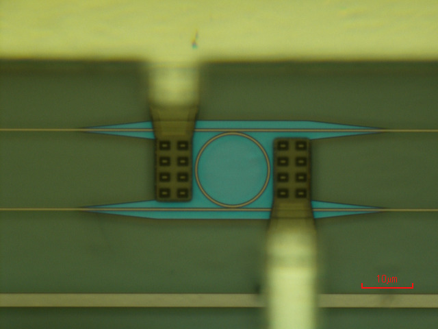

# Silicon Photonic Architecture for Training Deep Neural Networks

> Simulation code for our research article [Silicon Photonic Architecture for Training Deep Neural Networks](https://doi.org/10.1364/OPTICA.475493) published in Optica.

<p align="center">
  
</p>

In our paper, we propose on-chip training of neural networks enabled by a CMOS-compatible silicon photonic architecture to harness the potential for massively parallel, efficient, and fast data operations. Our scheme employs the direct feedback alignment training algorithm, which trains neural networks using error feedback rather than error backpropagation, and can operate at speeds of trillions of multiply-accumulate (MAC) operations per second while consuming less than one picojoule per MAC operation. The photonic architecture exploits parallelized matrix-vector multiplications using arrays of microring resonators for processing multi-channel analog signals along single waveguide buses to calculate the gradient vector for each neural network layer in situ. Our novel approach for efficient, ultra-fast neural network training showcases photonics as a promising platform for executing AI applications.

## Simulation

This Python program simulates training of feedforward neural networks on the MNIST dataset using analog photonic hardware. In our architecture, each MAC operation is performed by a microring resonator (pictured above). Our simulation injects accurately scaled Gaussian noise, which represents the error in our experimental inner product measurements, to the output of each MAC operation in the matrix-vector multiplication for calculating the gradient. Further details concerning the simulation of our photonic architecture are given in the [Supplementary](https://opticapublishing.figshare.com/articles/journal_contribution/Supplementary_document_for_Silicon_Photonic_Architecture_for_Training_Deep_Neural_Networks_with_Direct_Feedback_Alignment_-_6047116_pdf/21518115).

## Usage

Neural network training is executed using the `main.py` script which accepts command line arguments to specify the simulation parameters:

```bash
python main.py --hidden-layers 800 800 --error-std 0.618 --error-mean 0.03
```

The list of all command line arguments for `main.py` can be displayed as follows:
```bash
python main.py --help
```
## License

This work is distributed under the MIT License. See [LICENSE](LICENSE) for more information.

## Acknowledgements

This code was written  by [Matthew Filipovich](https://github.com/MatthewFilipovich) as part of a graduate research project at [Queen's University](https://www.queensu.ca/physics/home) (Kingston, Canada) and supervised by [Bhavin Shastri](https://www.queensu.ca/physics/shastrilab/).
